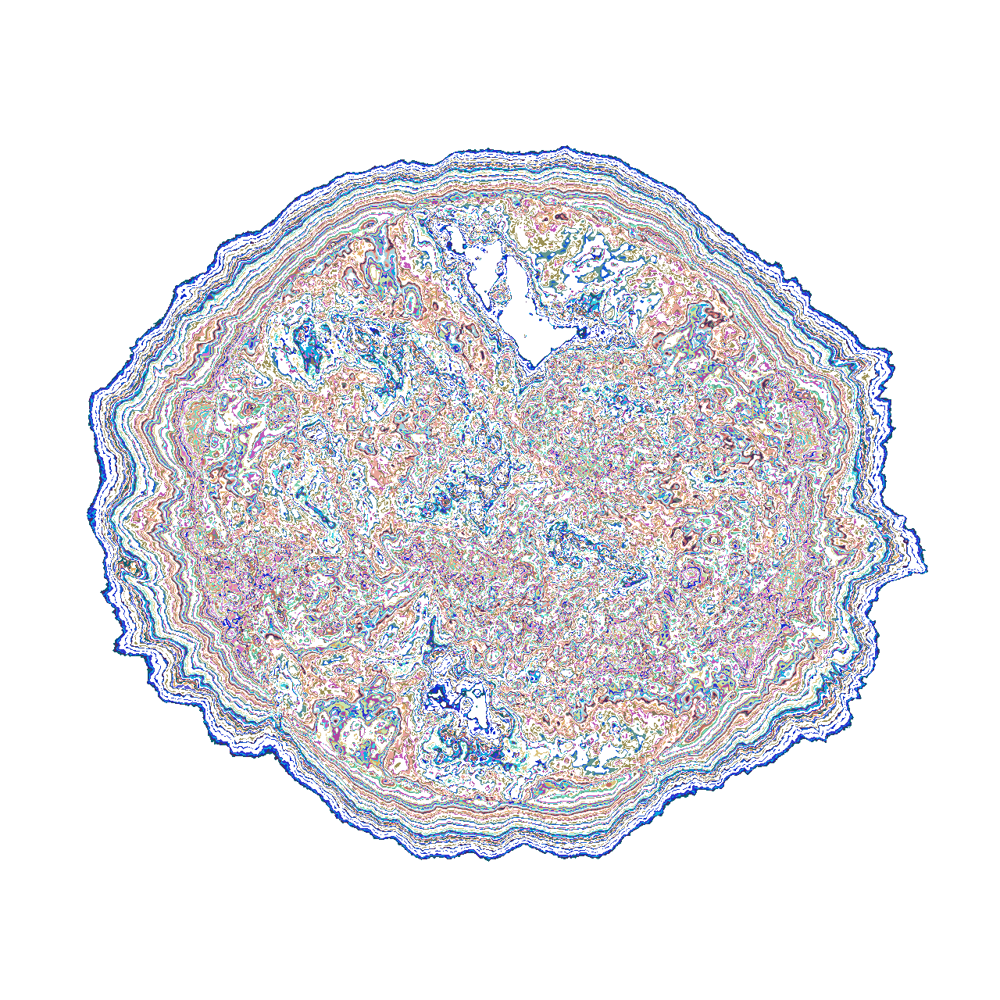
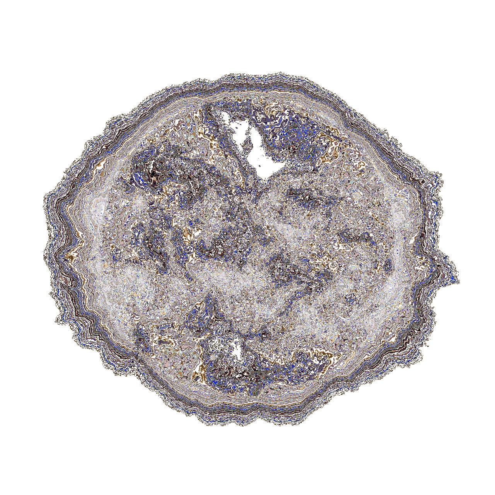
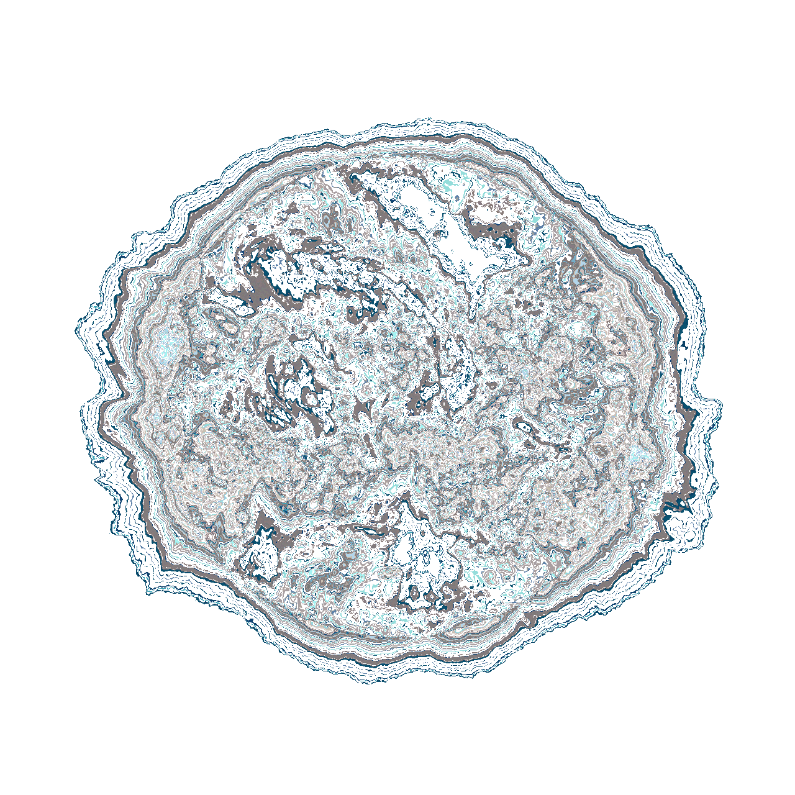
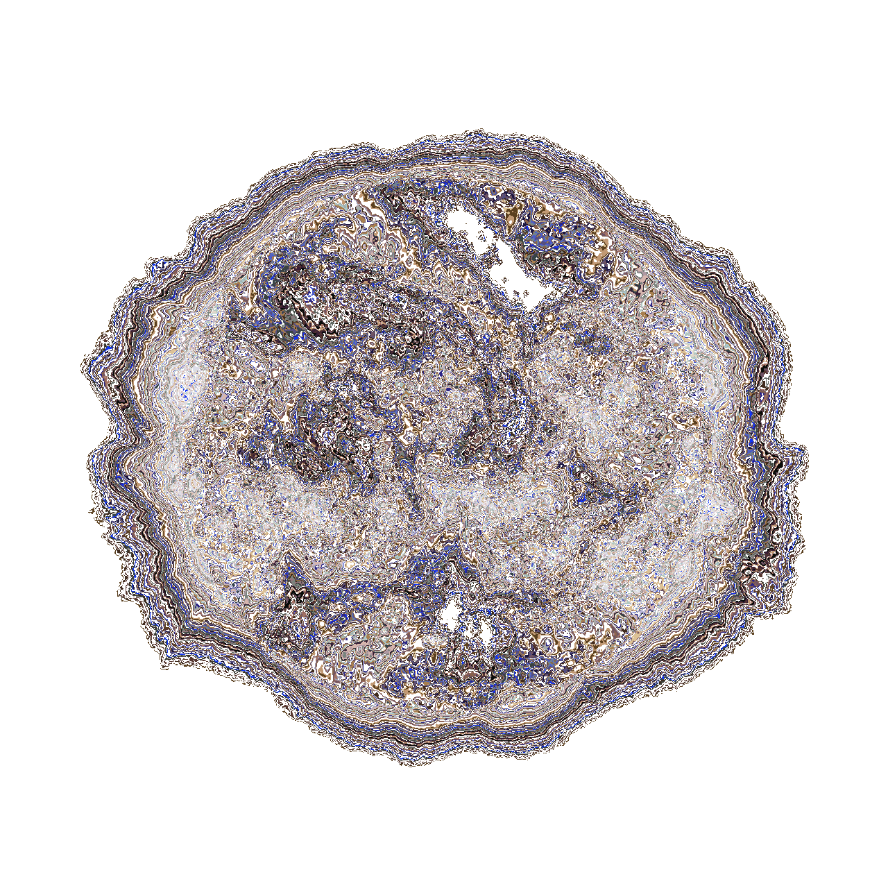
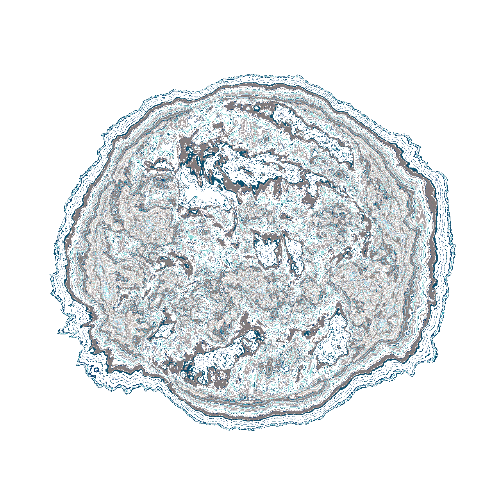
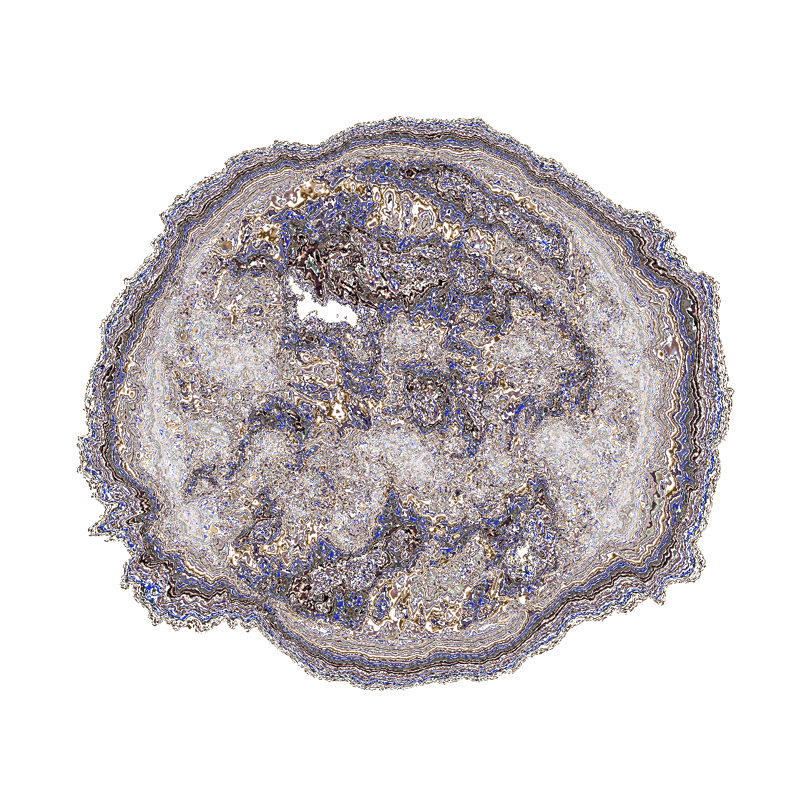
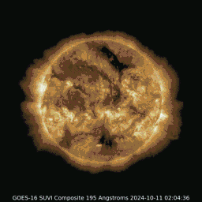
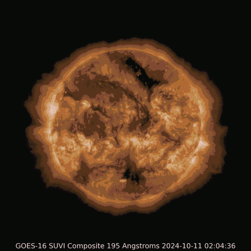
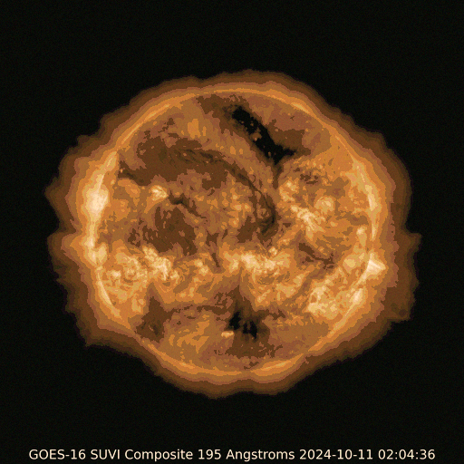

# Slices

Solar slice images from GOES-16 SUVI (October 2024).

---

## GOES-16 SUVI 2024-10-09 20:24:35

| 172885356400601 | 17288563639631228 |
|-----------------|-------------------|
|  |  |

---

## GOES-16 SUVI 2024-10-11 02:04:36

| 1728829255606069 | 172883321326781 |
|------------------|-----------------|
|  |  |

---

## GOES-16 SUVI 2024-10-13 16:48:38

| 172884006435888 | 17288439030393898 |
|-----------------|-------------------|
|  |  |

---

All images in this folder:

- `172885356400601-GOES-16SUVI-2024-10-09-20-24-35.png`
- `17288563639631228-GOES-16SUVI-2024-10-09-20-24-35.png`
- `1728829255606069-GOES-16SUVI-2024-10-11-02-04-36.png`
- `172883321326781-GOES-16SUVI-2024-10-11-02-04-36.png`
- `172884006435888-GOES-16SUVI-2024-10-13-16-48-38.png`
- `17288439030393898-GOES-16SUVI-2024-10-13-16-48-38.png`

---

## SolarFlare GOES Archive — GOES sequence LSTM

From `SolarFlare-GOES-Archive/` (GOES seq LSTM outputs).

| 0000 | 0001 | 0002 | 0003 | 0004 |
|------|------|------|------|------|
|  |  |  |  |  |

---

## SolarFlare GOES Archive — GOES-16 SUVI 2024-10-11 syn LSTM

From `SolarFlare-GOES-Archive/` (synthetic LSTM layers for GOES-16 SUVI 2024-10-11 02:04:36).

| 0000 | 0001 | 0002 | 0003 | 0004 |
|------|------|------|------|------|
|  |  |  |  |  |

---

All images in `SolarFlare-GOES-Archive/`:

- `1780438098096_0000_GOES_seq_0000_lstm.png`
- `1780438098096_0001_GOES_seq_0001_lstm.png`
- `1780438098096_0002_GOES_seq_0002_lstm.png`
- `1780438098096_0003_GOES_seq_0003_lstm.png`
- `1780438098096_0004_GOES_seq_0004_lstm.png`
- `1780438244666_0000_GOES-16SUVI-2024-10-11-02-04-36_syn_lstm.png`
- `1780438244666_0001_GOES-16SUVI-2024-10-11-02-04-36_syn_lstm.png`
- `1780438244666_0002_GOES-16SUVI-2024-10-11-02-04-36_syn_lstm.png`
- `1780438244666_0003_GOES-16SUVI-2024-10-11-02-04-36_syn_lstm.png`
- `1780438244666_0004_GOES-16SUVI-2024-10-11-02-04-36_syn_lstm.png`
